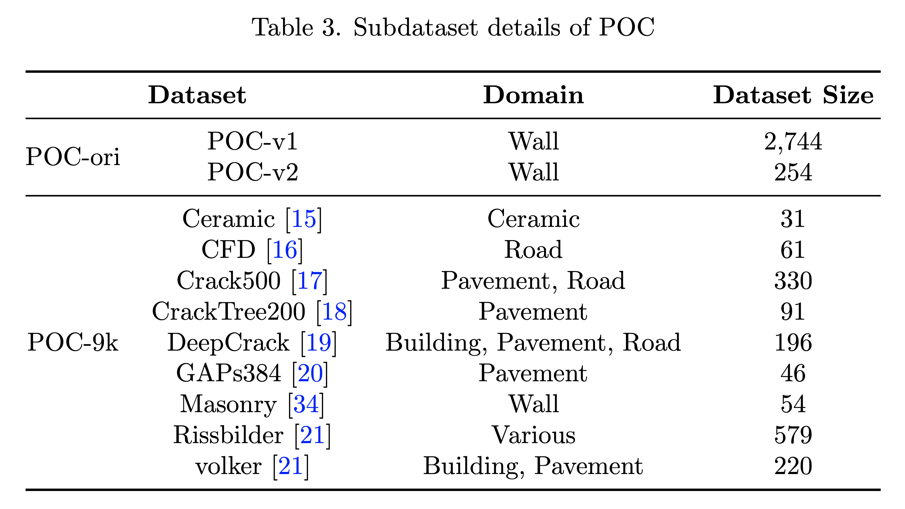
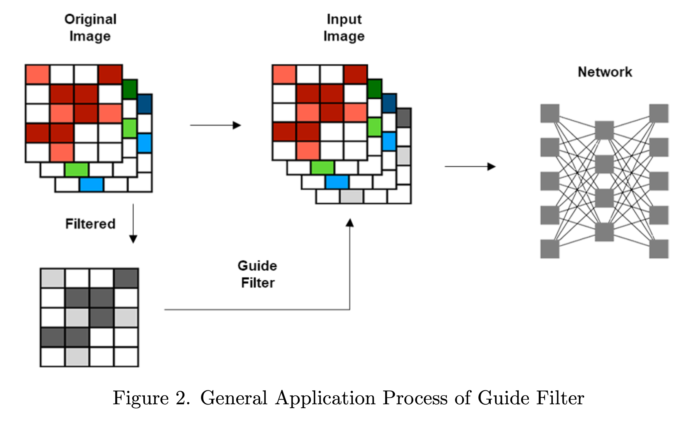
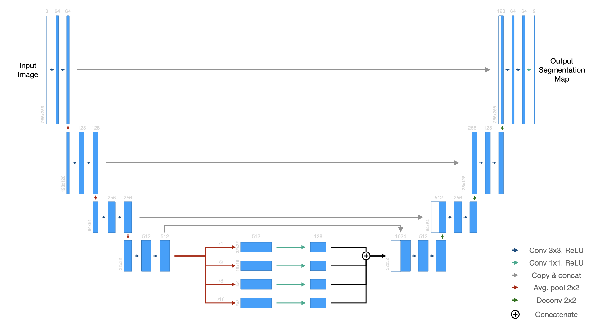
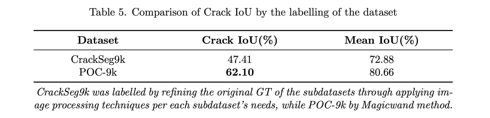
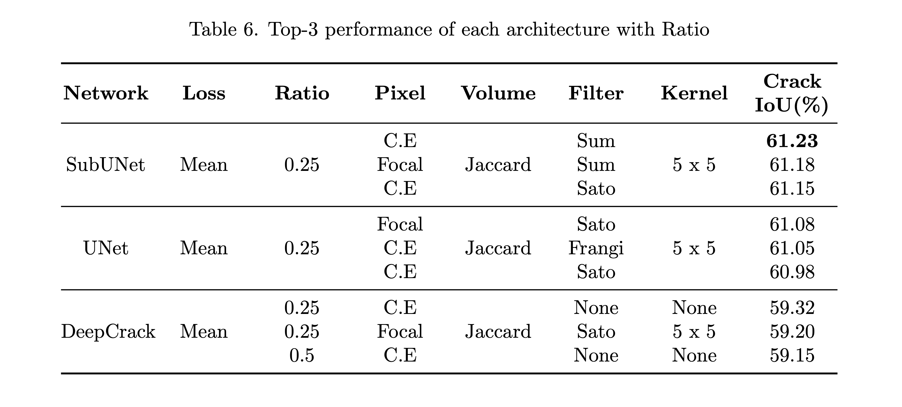

# Deep Learning to Deep Understanding: Study on Crack Segmentation regarding Dataset, Filter, Model and Loss

This repository contains the code & the graphs used to redact the research paper.

Soo Min Lee, Tristan Michel, Gyeong Young Kim, Byeong-il Hwang, DongJu Kim, Deep Learning to Deep Understanding: Study on Crack Segmentation regarding Dataset, Filter, Model and Loss, Image and Vision Computing, vol. X, no. X, pp. X-X, 2024. [[PDF]](https://link.to.pdf)

##### Abstract:
Crack segmentation plays a critical role in computer vision, particularly for detecting defects in infrastructure. This paper introduces a novel crack dataset and a specialized crack segmentation network, SubUNet, trained with specific configurations. The Pohang Crack (POC) dataset includes 4606 images sourced both publicly and locally from Pohang, Korea. To enhance dataset quality, we utilize the Magicwand labeling method, resulting in a 14.6% improvement in performance compared to the automated and manual labeling method of CrackSeg9k. SubUNet, incorporating the Pyramid Pooling Module into the UNet architecture, achieved better precision and spatial representation. In our comparative analysis of crack segmentation networks—DeepCrack, UNet, and SubUNet—we integrate the Mean loss function and Guide Filter layer in various configurations. Among the networks, those trained with Mean loss function, using a ratio of 0.25 pixel loss with 0.75 volume loss, and a Guide Filter derived from the Sum filter, which fuses the advantages of the Frangi and Sato filters, performed as the top-1 model in each network. SubUNet demonstrated superior precision in direct comparisons, achieving its peak performance with a Crack IoU of 61.23%.

### The POC dataset: a comprehensive collection of 4,606 pixel-wise annotated images showcasing a wide variety of real-world surfaces

The creation of the Pohang Crack (POC) dataset was motivated by the need for a comprehensive set of real-world crack data. The POC dataset is distinct in its inclusion of varied environmental conditions and crack types, addressing the limitations of prior datasets which often lack this diversity.



- POC-ori, encompasses diverse crack patterns from six distinct locales in Pohang, South Korea. Split into POC-v1 and POC-v2, it houses 2,744 images (640 × 480 pixels) and 254 high-resolution images (3000 × 4000 pixels), respectively. Images were photoed via smartphones, encompassing varying crack forms, light conditions, and textures, ensuring data diversity.
- POC-9k, a spin-off of CrackSeg9k, consolidates different datasets, creating a cohesive resource. The curation for POC-9k involved pruning synthetic, redundant, or watermarked images, refining content, and ensuring uniform image quality. The resultant images were aptly annotated and resized to 400 × 400 pixels.

#### Dataset links

You can download the POC dataset from the following links, (or use the script presented later to automaticaly download it)

<big><pre>
POC dataset:     [https://drive.google.com/file/d/1CIhofqCNqMOlFyPqg5gAAMO3UoxNe8qy/view](https://drive.google.com/file/d/1CIhofqCNqMOlFyPqg5gAAMO3UoxNe8qy/view)
POC-ori dataset: [https://drive.google.com/file/d/1WxfEDmMQq_Q-y6kC8HdNl4nI8rHS2Ujo/view](https://drive.google.com/file/d/1WxfEDmMQq_Q-y6kC8HdNl4nI8rHS2Ujo/view)
POC-9k dataset:  [https://drive.google.com/file/d/1Nn7P7PBXfYpOFL3E3A8b7yhF9kqlV6n4/view](https://drive.google.com/file/d/1Nn7P7PBXfYpOFL3E3A8b7yhF9kqlV6n4/view)
</pre></big>

### Guide Filter & SubUNet

- Our Guide Filter method, employs esteemed filters including Sobel, Laplacian, Frangi, and Sato to preprocess images for the training phase. By adding an auxiliary layer to the original RGB images, these filters can enrich the input image’s edge, shape, volume and textures.
- We used SubUNet, which incorporates a Pyramid Pooling Module to capture a wider range of spatial details. This integration enables accurate segmentation of intricate crack patterns and the architecture’s adaptability and performance in handling detailed structural variations within the segmentation task.
<p float="center">
  
   
</p>

### Results

Results from the re-labeling of `POC-9k`:


Results from the Network - Loss - Guide Filter combination analysis


## Installation

Use the package manager [conda](https://conda.io) to install `POC-env` which contain every library needed to run the application.

```bash
conda env create -f environment.yml
```

You also need jupyter to run the application (in the `POC-env` or in the base environement by linking the kernel).

```bash
conda install jupyter
```

### Downloading the Dataset

The dataset for this training is hosted on Google Drive at ([https://drive.google.com/file/d/1CIhofqCNqMOlFyPqg5gAAMO3UoxNe8qy/view](https://drive.google.com/file/d/1CIhofqCNqMOlFyPqg5gAAMO3UoxNe8qy/view)) and can be automatically downloaded by running this script.

```bash
cd data; ./download_dataset.sh
```

### Project Arechitecture

- `data/` &rarr; Folder containing the datasets ready for use by the program
  - `download_dataset.sh` &rarr; Script to automaticaly download the dataset in the project
  - `POC2` &rarr; Last version of the POC dataset with fixed distribution of the elements in `training` / `validation` / `testing`
  - `POCvsCS9` &rarr; Same but with masks from CS9's labeling and from POC's labeling to compare the difference made by our new labeling technique

- `src/` &rarr; Folder containing the application and its code
  - `main.ipynb` &rarr; Jupyter notebook used to run the training and testing of a model
  - `main_tune.ipynb` &rarr; Jupyter notebook used to run batches of training and testing of models for Hyperparameter Analysis
  - `dataset/ loss/ metrics/ models/ pipeline/` &rarr; Build as Python modules so can be easily imported in the notebook for execution
  - `train.py & train_tqdm.py` &rarr; Training loop (as module) with or witout the `tqdm` library for nice progress bar during training

  - `dataset/` &rarr; Each file is a different Pytorch Dataset. Composed of 2 parts: first a `DataReader()` that read the files then a `Dataset()` that load the images and apply the necessary transformations
    - `compare_dataset.py` &rarr; For the POC and CS9 dataset with fixed distribution of the elements (load only elements presents in `POC-9k`)
    - `CS9_dataset.py` &rarr; For the CS9 dataset (not in use anymore)
    - `POC_dataset.py` &rarr; For the POC dataset with fixed distribution of the elements
  - `loss/` &rarr; All loss functions used with each its own file
  - `metrics/` &rarr; Each metrics used for the evaluation and a Python class to record the evolution of the `training` / `validation` / `testing`
  - `model/` &rarr; Each network is its own file
  - `pipeline/` &rarr; The input pipeline used to edit the images before feeding them to the network
    - `filters/` &rarr; All the available filters for the pipeline in splited in 2 categories:
      - `basics` &rarr; Basics filter that can be used direcly or in combination with others
      - `small | medium | large kernel` &rarr; Filter with different kernel size (Can easily switch kernel size in the library import)

## Training

Training can be done in one of two ways.

1. Simple Training | Testing | Validation with fixed Hyperparameters using `main.ipynb`.
2. Hyperparameter Tuning using `main_tune.ipynb` that will determine the effect of each hyperparameter in the training.

## Citation

If you use our codes or datasets in your own research, the citation can be placed as:

```latex
@article{X,
  title={Deep Learning to Deep Understanding: Study on Crack Segmentation regarding Dataset, Filter, Model and Loss},
  author={Soo Min Lee, Tristan Michel, Gyeong Young Kim, Byeong-il Hwang, DongJu Kim},
  journal={Image and Vision Computing},
  volume={X},
  number={X},
  pages={X--X},
  year={2024},
  issn={X-X},
  doi={https://X},
  url={https://X},
  keywords={Crack Segmentation, Data Annotation, Guide Filter, Pyramid Pooling Module, Mean Loss},
  abstract={Crack segmentation plays a critical role in computer vision, particularly for detecting defects in infrastructure. This paper introduces a novel crack dataset and a specialized crack segmentation network, SubUNet, trained with specific configurations. The Pohang Crack (POC) dataset includes 4606 images sourced both publicly and locally from Pohang, Korea. To enhance dataset quality, we utilize the Magicwand labeling method, resulting in a 14.6% improvement in performance compared to the automated and manual labeling method of CrackSeg9k. SubUNet, incorporating the Pyramid Pooling Module into the UNet architecture, achieved better precision and spatial representation. In our comparative analysis of crack segmentation networks—DeepCrack, UNet, and SubUNet—we integrate the Mean loss function and Guide Filter layer in various configurations. Among the networks, those trained with Mean loss function, using a ratio of 0.25 pixel loss with 0.75 volume loss, and a Guide Filter derived from the Sum filter, which fuses the advantages of the Frangi and Sato filters, performed as the top-1 model in each network. SubUNet demonstrated superior precision in direct comparisons, achieving its peak performance with a Crack IoU of 61.23%.},
}
```

## Licence

This repository and everything under it was build for academic research.
The code and dataset are under XXX licence. (See LICENCE)

## Contact

For any problem about this dataset or codes, please contact DongJu Kim (<kkb0320@postech.ac.kr>).
